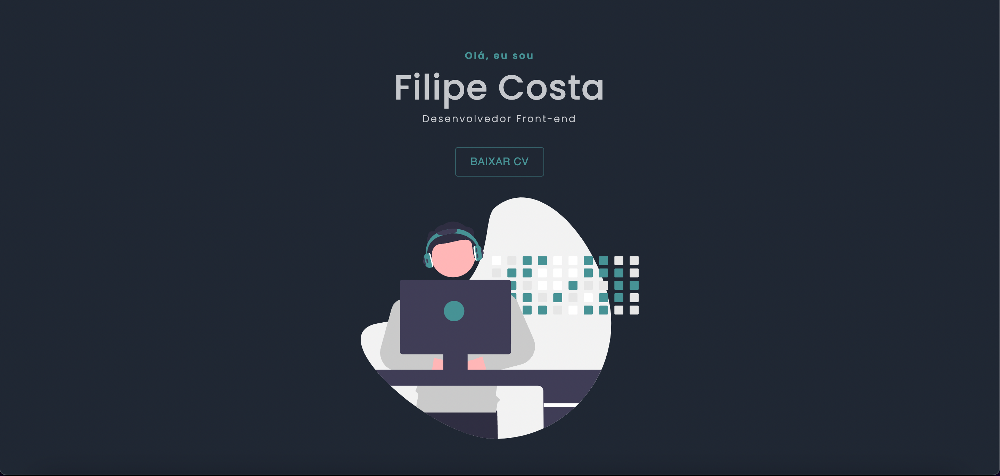

# Meu portifolio 

Nesse projeto venho trazendo meu portifolio pessoal, onde consta um pouco mais sobre quem sou e o que faço, nele poderá
 encontrar meu CV, projetos onde mostro minhas experiências nas linguagens que cito no site. Fique a vontade.
 
 
 
 # Sobre o projeto 
 
 Nesse site você poderá ver um pouco mais de quem eu sou e dos projetos que fiz, coloquei os mais relevantes, porém no github tenho outros projetos bem legais. 
 No site existe também uma área de contato onde poderá mandar email, ver o github, linkedin e entrar em contato por mensagem no whatsapp 
 
 ## 📚 Seções

O site é composto por cinco seções:

- **Quem sou:** Aqui saberá um pouco quem sou;
- **Projetos:** Alguns porjetos que fiz e links para o repositório no GitHub
- **Habilidades:** Mostra algumas habilidades que possuo; 
- **Entre em contato:* Onde poderá entrar em contato comigo de diversas formas;
 
 
 # Linguagens 
 
 
 
 
 
 
 
 

# Contribuições

<table>
  <tr>
    <td align="center">
      <a href="https://github.com/Filip3C0">
         
        
          <b>Filipe Costa</b>
        
      </a>
    </td>
  </tr>
</table>

# Agradecimentos 

Agradeço a todos do DevClub, comunidade exclusiva que faço parte onde me ajudaram muito com o feedback do meu projeto, bem como o Rafael Yokoyama que me ajudou com algumas coisas.

# Made with ❤️ 
